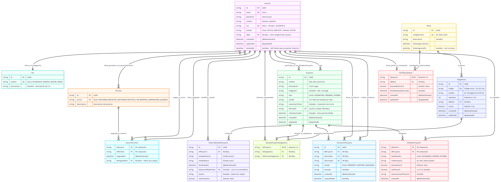

# 🗄️ Base de Datos - Hito 1 MVP

## Diagrama Entidad-Relación


## Tablas del MVP (Hito 1)

### Core
1. **Usuario** - Todos los usuarios del sistema
2. **Rol** - Categorías: ESTUDIANTE, DOCENTE, GESTOR, ADMIN
3. **Permiso** - Acciones: GESTIONAR_PROYECTOS, GESTIONAR_PRACTICAS, etc.
4. **UsuarioPermiso** - Asignación granular de permisos

### Académico
5. **Malla** - Versiones de la malla curricular (2018, 2023)
6. **Asignatura** - Catálogo de asignaturas por malla
7. **PerfilEstudiante** - Info académica del estudiante

### Proyectos
8. **Proyecto** - Entidad principal
9. **DetalleProyectoAsignatura** - Info específica de proyectos de asignatura
10. **MiembroProyecto** - Participantes (M:M con campos extra)
11. **HistorialEstadoProyecto** - Auditoría de cambios
12. **InvitacionProyecto** - Invitaciones a colaboradores

## Estados por Tipo de Proyecto

### ASIGNATURA
```
PENDIENTE_APROBACION → EN_PROCESO → APROBADO / REPROBADO
```

### PERSONAL
```
EN_PROCESO ↔ EN_PAUSA → FINALIZADO / CANCELADO
```

### EXTERNO
```
PENDIENTE_APROBACION → EN_PROCESO / RECHAZADO
RECHAZADO → PENDIENTE_APROBACION (repostulación)
EN_PROCESO → EN_PAUSA / CANCELADO / FINALIZADO
```
## Índices Principales
```sql
-- Búsquedas frecuentes
CREATE INDEX idx_usuario_email ON usuario(email);
CREATE INDEX idx_usuario_rut ON usuario(rut);
CREATE INDEX idx_proyecto_tipo_estado ON proyecto(tipo, estado);
CREATE INDEX idx_proyecto_creador ON proyecto(id_creador);
CREATE INDEX idx_miembro_proyecto_usuario ON miembro_proyecto(id_usuario);
```

## Relaciones Clave

- **Usuario → Proyecto**: 1:N (creador) + N:M (miembros)
- **Proyecto → DetalleAsignatura**: 1:1 (solo si tipo=ASIGNATURA)
- **Usuario → PerfilEstudiante**: 1:1 (solo si rol=ESTUDIANTE)
- **Malla → Asignatura**: 1:N

## Validaciones en Código

Reglas que Prisma NO puede validar (se validan en Services):

1. Proyectos ASIGNATURA deben tener `DetalleProyectoAsignatura`
2. Solo ESTUDIANTES pueden crear proyectos ASIGNATURA
3. Estados válidos por tipo de proyecto
4. Calificación entre 1.0 - 7.0
5. Solo propietario puede invitar (proyectos PERSONAL)

## Soft Delete

La tabla `Usuario` usa soft delete (`deletedAt`):
- Preserva integridad referencial
- No se pierde historial de proyectos/prácticas
- Queries filtran con `WHERE deleted_at IS NULL`

## Próximos Hitos (ataque de ansiedad)

**Hito 2:**
- DetalleProyectoExterno
- OfertaPractica
- Practica
- DocumentoEntrega
- ContactoExterno
- Artefacto

**Hito 3:**
- BitacoraProyecto
- Habilidad + HabilidadUsuario